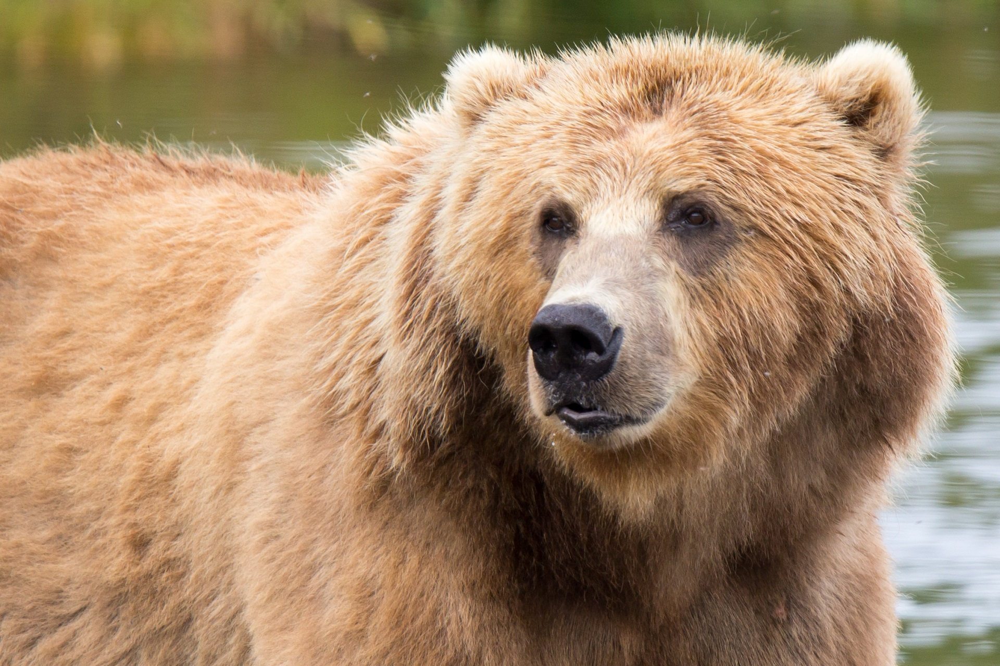
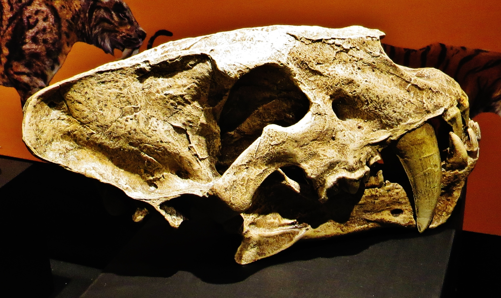

```{r setup, include = FALSE}
library(tidyverse)
library(RColorBrewer)
library(knitr)
```

<!-- adding bold and italic options -->
<style>
em {
  font-style: italic
}
strong {
  font-weight: bold;
}
</style>

## Discoveries facilitated by ancient DNA

- General challenges
- Phylogeny
- Admixture
- Genetic diversity
- Behaviour

```{r, out.width = "50%", dpi = 300, fig.align = "right", echo = FALSE, fig.cap=""}
include_graphics("./assets/img/brown-bear-4248371.png")
```

--- .segue .dark 

## General challenges

--- &thirds

## Few individuals

*** =left

- High lab costs
- Low success rate
- Incomplete fossil record
- Genome data increases sampling of loci
- But some questions/methods still need many individuals

*** =right

```{r, out.width = "100%", dpi = 300, fig.align = "right", echo = FALSE, fig.cap=""}
include_graphics("./assets/img/sample-size-definition.png")
```

---

## Low coverage and high error rates

- Cost and number of molecules limits coverage (nuclear genome typically 0-4x)

```{r, out.width = "100%", dpi = 300, fig.align = "right", echo = FALSE, fig.cap=""}
include_graphics("./assets/img/coverage.svg")
```

--- .segue .dark 

## Phylogeny

--- &twocol

## Phylogeny methods

- Quite suited to few individuals

**mtDNA**

- Generally high coverage
- Some large mtDNA datasets (mammoths, cave bears, humans)
- Frequently used for molecular dating

**Nuclear genomes**

- Low coverage OK for topology
- Errors do affect branch lengths

```{r, out.width = "20%", dpi = 300, fig.align = "right", echo = FALSE, fig.cap=""}
include_graphics("./assets/img/brown-bear-4248371.png")
```

--- &twocol

## Macrauchenia

*** =left

- Endemic South American mammal
- Extinct ~10 Ka
- First collected 1834
- Charles Darwin, HMS Beagle
- Divergence time unknown
- No close reference

*** =right

```{r, out.width = "100%", dpi = 300, echo = FALSE, fig.align='center', fig.cap=""}
include_graphics("./assets/img/WWB_Macrauchenia_render.webp")
```

---

## Macrauchenia

```{r, out.width = "100%", dpi = 300, echo = FALSE, fig.align='center', fig.cap=""}
include_graphics("./assets/img/macrauch.svg")
```

---

## Macrauchenia

```{r, out.width = "100%", out.height=500, dpi = 300, echo = FALSE, fig.cap=""}
  include_graphics("./assets/img/Westbury et al. - 2017 - A mitogenomic timetree for Darwin’s enigmatic South American mammal Macrauchenia patachonica.pdf")
```

--- &thirds

## European leopards

*** =left

```{r, out.width = "120%", dpi = 300, echo = FALSE, fig.align='center', fig.cap=""}
include_graphics("./assets/img/leopard-1984124.png")
```

*** =right

```{r, out.width = "100%", dpi = 300, echo = FALSE, fig.align='center', fig.cap=""}

```

---

## European leopards

```{r, out.width = "70%", dpi = 300, echo = FALSE, fig.align='center', fig.cap=""}
include_graphics("./assets/img/leo_phy.svg")
```

---

## European leopards

```{r, out.width = "100%", out.height=500, dpi = 300, echo = FALSE, fig.cap=""}
  include_graphics("./assets/img/Paijmans et al. - 2018 - Historical biogeography of the leopard (Panthera pardus) and its extinct Eurasian populations.pdf")
```

--- &twocol

## Cave hyena

*** =left

- Widespread and common across Eurasia during Pleistocene
- Morphologically distinguishable from African *Crocuta*
- Evolutionary/taxonomic status debated

```{r, out.width = "75%", dpi = 300, echo = FALSE, fig.align='center', fig.cap=""}
  include_graphics("./assets/img/Drawings-bear-panther-hyena-Ardeche-France-Chauvet-Pont.webp")
```

*** =right

```{r, out.width = "90%", dpi = 300, echo = FALSE, fig.align='center', fig.cap=""}
  include_graphics("./assets/img/croc2.jpg")
```

---

## Cave hyena

```{r, out.width = "100%", dpi = 300, echo = FALSE, fig.align='center', fig.cap=""}
  include_graphics("./assets/img/croc_mtDNA.svg")
```

---

## Cave hyena

```{r, out.width = "100%", dpi = 300, echo = FALSE, fig.align='center', fig.cap=""}
  include_graphics("./assets/img/croc_nuc.svg")
```

---

## Cave hyena

```{r, out.width = "100%", out.height=500, dpi = 300, echo = FALSE, fig.cap=""}
  include_graphics("./assets/img/Westbury et al. - 2020 - Hyena paleogenomes reveal a complex evolutionary history of cross-continental gene flow between spotted and cav.pdf")
```

--- .segue .dark 

## Admixture

---

## Admixture methods

- Only really possible with nuclear genomes
- D statistics or tree based methods
- Works with low coverage
- Works with few individuals
- Often run in conjunction with phylogenetic analyses

```{r, out.width = "50%", dpi = 300, fig.align = "right", echo = FALSE, fig.cap=""}
include_graphics("./assets/img/brown-bear-4248371.png")
```

--- &twocol

## Brown bears and polar bears

*** =left

- Diverged ~1 Ma
- Parapatric distribution
- Ecologically differentiated
- Morphologically differentiated
- Glacial cycles shifted contact zone
- E.g. Ireland during LGM

*** =right

```{r, out.width = "80%", dpi = 300, echo = FALSE, fig.align='center', fig.cap=""}
  
```

```{r, out.width = "80%", dpi = 300, echo = FALSE, fig.align='center', fig.cap=""}
  include_graphics("./assets/img/polar-bear-404314.jpg")
```

---

## Brown bears and polar bears

```{r, out.width = "100%", dpi = 300, echo = FALSE, fig.align = "center", fig.cap=""}
  include_graphics("./assets/img/flow.svg")
```

--- bg:white

## Brown bears and polar bears

```{r, out.width = "90%", dpi = 300, echo = FALSE, fig.align = "center", fig.cap=""}
  include_graphics("./assets/img/ireland.svg")
```

---

## Brown bears and polar bears

```{r, out.width = "100%", out.height=500, dpi = 300, echo = FALSE, fig.cap=""}
  include_graphics("./assets/img/Cahill et al. - 2018 - Genomic Evidence of Widespread Admixture from Polar Bears into Brown Bears during the Last Ice Age.pdf")
```

--- &twocol

## Cave bears and brown bears

*** =left

```{r, out.width = "100%", dpi = 300, echo = FALSE, fig.cap=""}
include_graphics("./assets/img/Ursus_spelaeus_Sergiodlarosa.jpg")
```

```{r, out.width = "35%", dpi = 300, fig.align = "center", echo = FALSE, fig.cap=""}
include_graphics("./assets/img/sp_tree.svg")
```

*** =right

```{r, out.width = "100%", dpi = 300, echo = FALSE, fig.cap=""}
include_graphics("./assets/img/kudarensis.png")
```

```{r, out.width = "80%", dpi = 300, fig.align = "center", echo = FALSE, fig.cap=""}
  include_graphics("./assets/img/2560px-Flickr_-_Wikimedia_France_-_machoire_ours_IMG_1507.jpg")
```

--- &thirds 

## Cave bears and brown bears

*** =left

```{r, out.width = "100%", dpi = 300, fig.align = "center", echo = FALSE, fig.cap=""}
  
```

*** =right

```{r, out.width = "75%", dpi = 300, fig.align = "center", echo = FALSE, fig.cap=""}
  include_graphics("./assets/img/cave_admix.svg")
```

---

## Cave bears and brown bears

```{r, out.width = "100%", out.height=500, dpi = 300, echo = FALSE, fig.cap=""}
  include_graphics("./assets/img/Barlow et al. - 2018 - Partial genomic survival of cave bears in living brown bears.pdf")
```

--- &twocol

## Columbian mammoth

- *Mammuthus columbi* inhabited North America during Pleistocene
- Extinct ~12 Ka

*** =left

```{r, out.width = "100%", dpi = 300, fig.align = "center", echo = FALSE, fig.cap=""}
  include_graphics("./assets/img/Mammuthus_columbi_Page.jpg")
```

*** =right

```{r, out.width = "100%", dpi = 300, fig.align = "center", echo = FALSE, fig.cap=""}
  include_graphics("./assets/img/North_American_mammoth_map.jpg")
```

--- bg:white

## Columbian mammoth

```{r, out.width = "90%", dpi = 300, fig.align = "center", echo = FALSE, fig.cap=""}
  include_graphics("./assets/img/mammoth_admix.svg")
```

---

## Columbian mammoth

```{r, out.width = "100%", out.height=500, dpi = 300, echo = FALSE, fig.cap=""}
  include_graphics("./assets/img/van der Valk et al. - 2021 - Million-year-old DNA sheds light on the genomic history of mammoths(2).pdf")
```

--- .segue .dark 

## Genetic diversity

---

## Genetic diversity methods

- Some early attempts with mitochondrial DNA, not so convincing
- Much better with nuclear genomes
- Coverage is a problem
- Sophisticated analytical methods: genotype likelihoods
- Tends to use individual heterozygosity (few individuals)
- And inbreeding measures using Runs of Homozygosity (ROH)


```{r, out.width = "40%", dpi = 300, fig.align = "right", echo = FALSE, fig.cap=""}
include_graphics("./assets/img/brown-bear-4248371.png")
```

---

## Runs of homozygosity (ROH)

- Chromosome regions are identical by descent
- Can be calculated from pedigrees
- Genome sequencing allows identification of **runs of homozygosity (ROH)**

```{r, out.width = "75%", dpi = 300, echo = FALSE, fig.align = "center", fig.cap=""}
  include_graphics("./assets/img/recom_roh.svg")
```

--- bg:white

## Runs of homozygosity (ROH)

- Total inbreeding = ROH content
- Recent = long ROH
- Older = short ROH

```{r, out.width = "95%", fig.width = 8, fig.height = 3, dpi = 300, echo = FALSE, fig.align='center', fig.cap=""}
my_roh_hi <- jitter(c(rep(0.0013, times=100)), factor=5)
my_roh_lo <- jitter(c(rep(0.0000000001, times=100)), factor=6)
my_roh <- c(my_roh_hi, my_roh_lo, my_roh_lo, my_roh_hi, my_roh_hi, my_roh_hi, my_roh_lo, my_roh_hi, my_roh_hi, my_roh_hi)

plot(c(1:1000), my_roh, type="l", 
ylim=c(0,0.0015), axes=FALSE, frame.plot=TRUE,
xlab="Chromosome position (Mb)", ylab="Het sites/kb",
main=""
)

axis(1, at=c(0,200,400,600,800,1000), labels=c("0","20","40","60","80","100"), las=1)
axis(2, at=c(0,0.0005,0.001,0.0015), labels=c("0","0.5","1.0","1.5"), las=2)
```

--- &twocol

## *Homotherium*

*** =left

- Lesser known sabretooth
- Serrated canines!
- Fossil record patchy
- Rare or just poor fossil record?

*** =right

```{r, out.width = "90%", dpi = 300, fig.align = "center", echo = FALSE, fig.cap=""}
  include_graphics("./assets/img/Homotherium_serum.jpg")
```

```{r, out.width = "90%", dpi = 300, fig.align = "center", echo = FALSE, fig.cap=""}
  
```

---

## *Homotherium*

```{r, out.width = "100%", dpi = 300, fig.align = "left", echo = FALSE, fig.cap=""}
  include_graphics("./assets/img/homo_het.svg")
```

---

## *Homotherium*

```{r, out.width = "100%", out.height=500, dpi = 300, echo = FALSE, fig.cap=""}
  include_graphics("./assets/img/Barnett et al. - 2020 - Report Genomic Adaptations and Evolutionary History of the Extinct Scimitar-Toothed Cat , Homotherium latidens G.pdf")
```

--- &twocol

## White rhinos

*** =left

- Two subspecies: northern and southern
- ~20,000 southern white rhinos (in 2015)
- Northern white rhino functionally extinct (2 females left in 2018)

```{r, out.width = "65%", dpi = 300, echo = FALSE, fig.align='center', fig.cap=""}
include_graphics("./assets/img/rhin_map.svg")
```

*** =right

```{r, out.width = "60%", dpi = 300, echo = FALSE, fig.align='center', fig.cap=""}
include_graphics("./assets/img/1920px-Ceratotherium_simum_(21922261908).jpg")
```

```{r, out.width = "75%", dpi = 300, echo = FALSE, fig.align='center', fig.cap=""}
include_graphics("./assets/img/rhin_demo.svg")
```

---

## White rhinos

```{r, out.width = "100%", dpi = 300, echo = FALSE, fig.align='center', fig.cap=""}
include_graphics("./assets/img/rhin_res.svg")
```

---

## White rhinos

```{r, out.width = "100%", out.height=500, dpi = 300, echo = FALSE, fig.cap=""}
  include_graphics("./assets/img/Sánchez-Barreiro et al. - 2021 - Historical population declines prompted significant genomic erosion in the northern and southern white.pdf")
```

--- &thirds

## Wrangel Island mammoths

*** =left

- Last mammoths
- Survived until 4 Ka
- 17x coverage

```{r, out.width = "100%", dpi = 300, echo = FALSE, fig.align='center', fig.cap=""}
include_graphics("./assets/img/wrangel_map.svg")
```

*** =right

```{r, out.width = "100%", dpi = 300, echo = FALSE, fig.align='center', fig.cap=""}
include_graphics("./assets/img/Last-Woolly-Mammoths-Lived-on-Wrangel-Island.jpg")
```

---

## Wrangel Island mammoths

```{r, out.width = "100%", dpi = 300, echo = FALSE, fig.align='center', fig.cap=""}
include_graphics("./assets/img/wrangel.svg")
```

---

## Wrangel Island mammoths

```{r, out.width = "100%", out.height=500, dpi = 300, echo = FALSE, fig.cap=""}
  include_graphics("./assets/img/2015-Complete_genomes_reveal_signatures_of_demographic_and_genetic_declines_in_the_woolly_mammoth.pdf")
```

--- .segue .dark 

## Behaviour

---

## Behaviour methods

- Very few behavioural studies (5)
- Most modern studies rely on measuring relatedness
- Hard with few individuals
- Some successes with:
  - mitochondrial relationships
  - genetic sexing
  - relatedness (msats!)
  - multidisciplinary (e.g. diet and genetics)


```{r, out.width = "30%", dpi = 300, fig.align = "right", echo = FALSE, fig.cap=""}
include_graphics("./assets/img/brown-bear-4248371.png")
```

---

## Cave bear homing behaviour

```{r, out.width = "70%", dpi = 300, echo = FALSE, fig.align='center', fig.cap=""}
  include_graphics("./assets/img/map.png")
```

- 5 caves
- 4 are within a few kms
- 26 cave bear mitochondrial genomes generated using hybridisation capture
- Some have radiocarbon dates

---

## Cave bear homing behaviour

- Caves occupied more or less simultaneously

```{r, out.width = "100%", dpi = 300, echo = FALSE, fig.align='center', fig.cap=""}
  include_graphics("./assets/img/dating.svg")
```

---

## Cave bear homing behaviour

- Each cave generally contains unique set of related haplotypes
- Bears returned to their birth cave for hibernation

```{r, out.width = "100%", dpi = 300, echo = FALSE, fig.align='center', fig.cap=""}
  
```

---

## Cave bear homing behaviour

```{r, out.width = "100%", out.height=500, dpi = 300, echo = FALSE, fig.cap=""}
  include_graphics("./assets/img/Fortes et al. - 2016 - Ancient DNA reveals differences in behaviour and sociality between brown bears and extinct cave bears(2).pdf")
```

---

## Mammoth male mortality

- Male excess: caught in natural traps which favour preservation

```{r, out.width = "100%", dpi = 300, echo = FALSE, fig.align='center', fig.cap=""}
  include_graphics("./assets/img/mamm_sex.svg")
```

---

## Mammoth male mortality

```{r, out.width = "100%", out.height=500, dpi = 300, echo = FALSE, fig.cap=""}
  include_graphics("./assets/img/Pečnerová et al. - 2017 - Genome-Based Sexing Provides Clues about Behavior and Social Structure in the Woolly Mammoth.pdf")
```

--- &twocol bg:white

## Moa egg incubation

*** =left

```{r, out.width = "55%", dpi = 300, echo = FALSE, fig.align='center', fig.cap=""}
include_graphics("./assets/img/moa.jpg")
```

*** =right

- New Zealand endemic radiation
- 6 genera
- 6m / 230 kg

```{r, out.width = "100%", dpi = 300, echo = FALSE, fig.align='center', fig.cap=""}

```

---

## Moa egg incubation

```{r, out.width = "100%", dpi = 300, echo = FALSE, fig.align='center', fig.cap=""}
include_graphics("./assets/img/eggs.svg")
```

---

## Moa egg incubation

```{r, out.width = "100%", out.height=500, dpi = 300, echo = FALSE, fig.cap=""}
  include_graphics("./assets/img/Huynen et al. - 2010 - Ancient DNA reveals extreme egg morphology and nes.pdf")
```

--- 

## Summary

- Revolutionary insights into extinct and extant species
- Challenge of few individuals
- Challenge of low coverage and error rates
- Difficult to plan/design experiments

### Worth it!

```{r, out.width = "50%", dpi = 300, fig.align = "right", echo = FALSE, fig.cap=""}
include_graphics("./assets/img/brown-bear-4248371.png")
```

--- &thankyou

## That's all folks!
