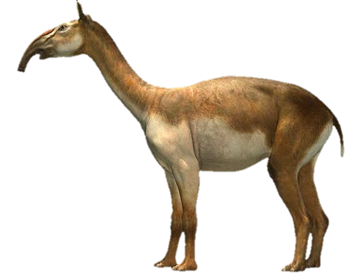
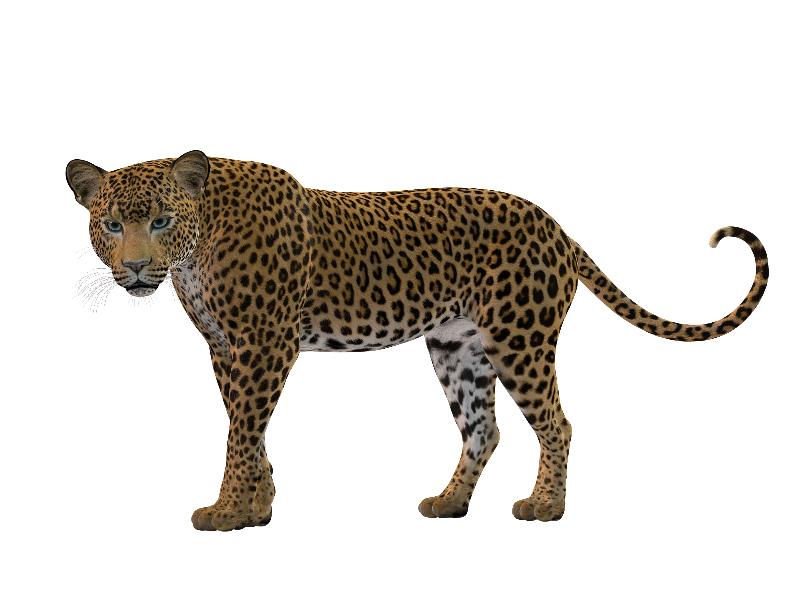
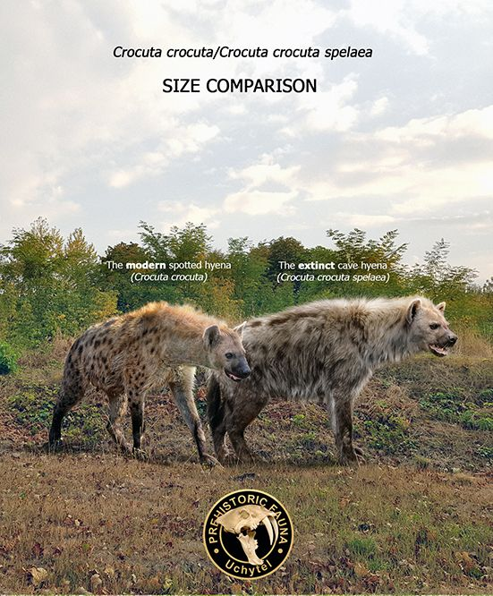
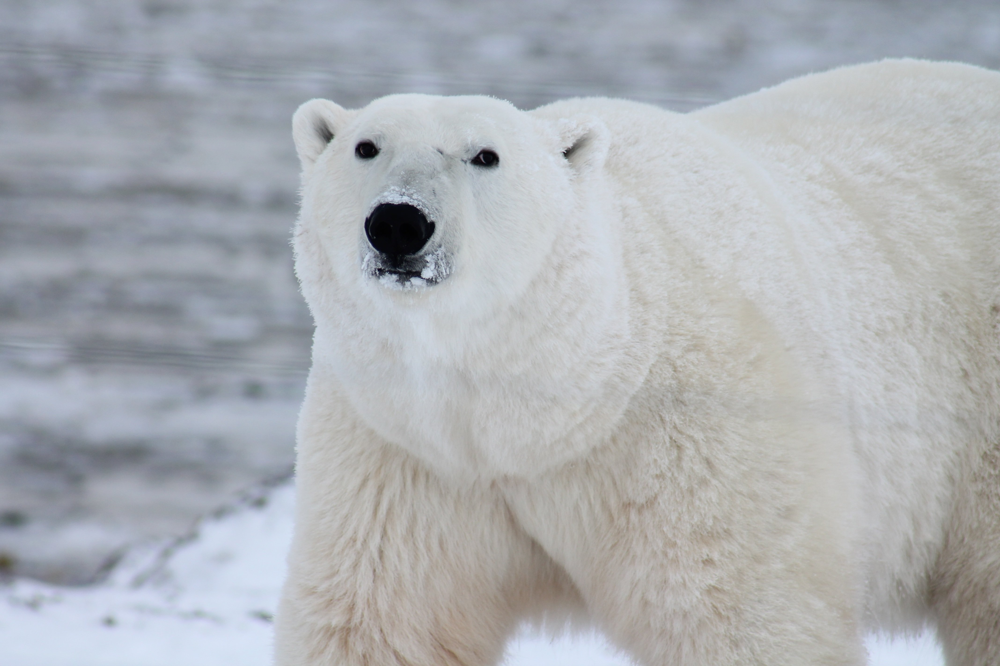
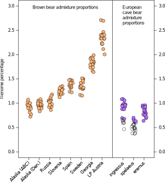
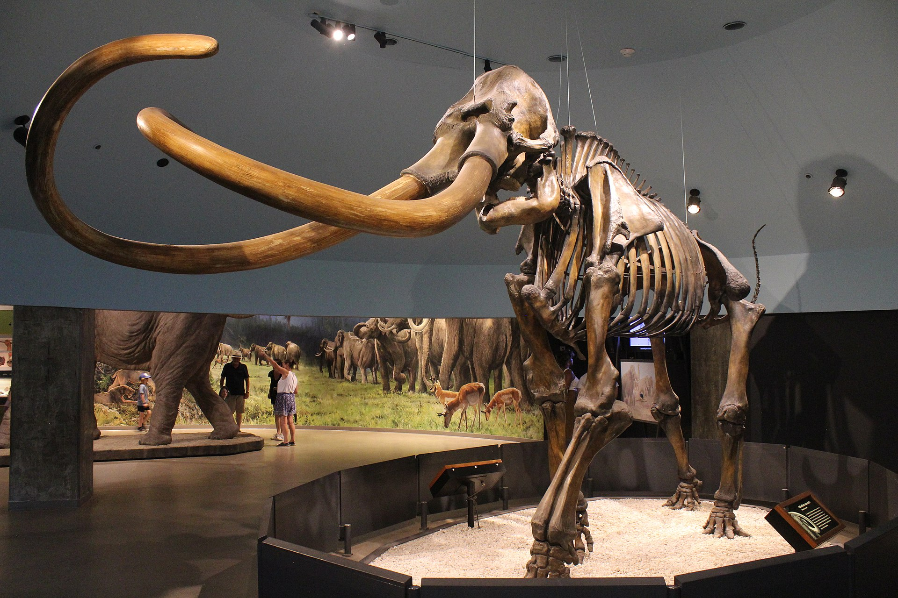
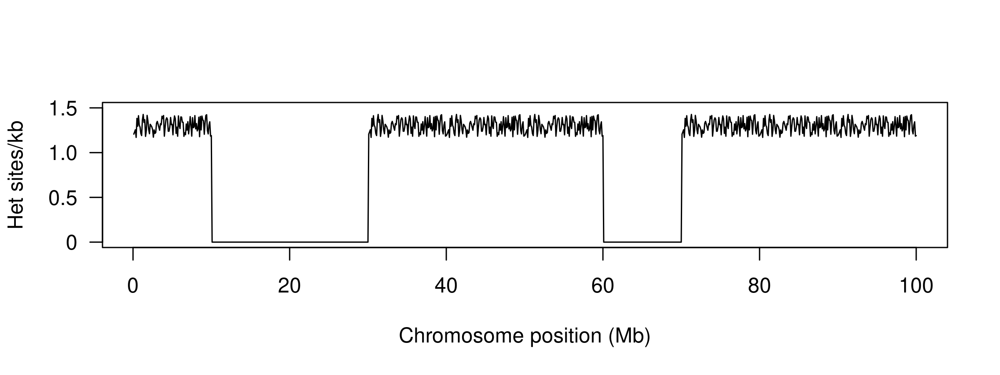
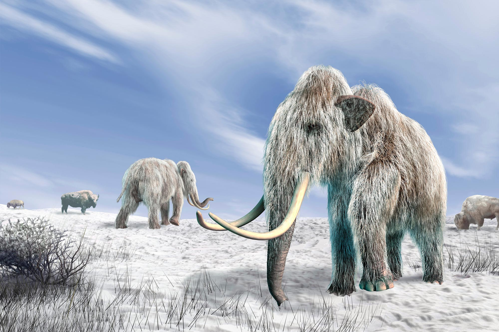
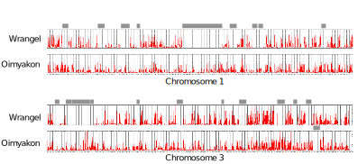
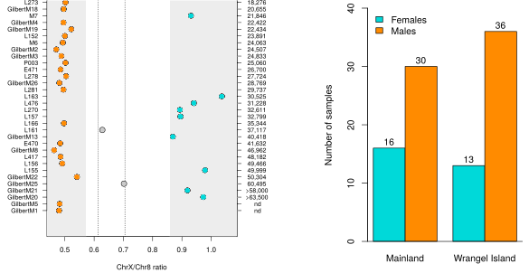

<!-- adding bold and italic options -->

## Discoveries facilitated by ancient DNA

- General challenges
- Phylogeny
- Admixture
- Genetic diversity
- Behaviour

--- .segue .dark 

## General challenges

--- &thirds

## Few individuals

*** =left

- High lab costs
- Low success rate
- Incomplete fossil record
- Genome data increases sampling of loci
- But some questions/methods still need many individuals

*** =right

---

## Low coverage and high error rates

- Cost and number of molecules limits coverage (nuclear genome typically 0-4x)

--- .segue .dark 

## Phylogeny

--- &twocol

## Phylogeny methods

- Quite suited to few individuals

**mtDNA**

- Generally high coverage
- Some large mtDNA datasets (mammoths, cave bears, humans)
- Frequently used for molecular dating

**Nuclear genomes**

- Low coverage OK for topology
- Errors do affect branch lengths

--- &twocol

## Macrauchenia

*** =left

- Endemic South American mammal
- Extinct ~10 Ka
- First collected 1834
- Charles Darwin, HMS Beagle
- Divergence time unknown
- No close reference

*** =right

---

## Macrauchenia

---

## Macrauchenia

<embed src="./assets/img/Westbury et al. - 2017 - A mitogenomic timetree for Darwin’s enigmatic South American mammal Macrauchenia patachonica.pdf" width="100%" height="500" type="application/pdf" />

--- &thirds

## European leopards

*** =left

*** =right

---

## European leopards

---

## European leopards

<embed src="./assets/img/Paijmans et al. - 2018 - Historical biogeography of the leopard (Panthera pardus) and its extinct Eurasian populations.pdf" width="100%" height="500" type="application/pdf" />

--- &twocol

## Cave hyena

*** =left

- Widespread and common across Eurasia during Pleistocene
- Morphologically distinguishable from African *Crocuta*
- Evolutionary/taxonomic status debated

*** =right

---

## Cave hyena

---

## Cave hyena

---

## Cave hyena

<embed src="./assets/img/Westbury et al. - 2020 - Hyena paleogenomes reveal a complex evolutionary history of cross-continental gene flow between spotted and cav.pdf" width="100%" height="500" type="application/pdf" />

--- .segue .dark 

## Admixture

---

## Admixture methods

- Only really possible with nuclear genomes
- D statistics or tree based methods
- Works with low coverage
- Works with few individuals
- Often run in conjunction with phylogenetic analyses

--- &twocol

## Brown bears and polar bears

*** =left

- Diverged ~1 Ma
- Parapatric distribution
- Ecologically differentiated
- Morphologically differentiated
- Glacial cycles shifted contact zone
- E.g. Ireland during LGM

*** =right

---

## Brown bears and polar bears

--- bg:white

## Brown bears and polar bears

---

## Brown bears and polar bears

<embed src="./assets/img/Cahill et al. - 2018 - Genomic Evidence of Widespread Admixture from Polar Bears into Brown Bears during the Last Ice Age.pdf" width="100%" height="500" type="application/pdf" />

--- &twocol

## Cave bears and brown bears

*** =left

*** =right

--- &thirds 

## Cave bears and brown bears

*** =left

*** =right

---

## Cave bears and brown bears

<embed src="./assets/img/Barlow et al. - 2018 - Partial genomic survival of cave bears in living brown bears.pdf" width="100%" height="500" type="application/pdf" />

--- &twocol

## Columbian mammoth

- *Mammuthus columbi* inhabited North America during Pleistocene
- Extinct ~12 Ka

*** =left

*** =right

--- bg:white

## Columbian mammoth

---

## Columbian mammoth

<embed src="./assets/img/van der Valk et al. - 2021 - Million-year-old DNA sheds light on the genomic history of mammoths(2).pdf" width="100%" height="500" type="application/pdf" />

--- .segue .dark 

## Genetic diversity

---

## Genetic diversity methods

- Some early attempts with mitochondrial DNA, not so convincing
- Much better with nuclear genomes
- Coverage is a problem
- Sophisticated analytical methods: genotype likelihoods
- Tends to use individual heterozygosity (few individuals)
- And inbreeding measures using Runs of Homozygosity (ROH)

---

## Runs of homozygosity (ROH)

- Chromosome regions are identical by descent
- Can be calculated from pedigrees
- Genome sequencing allows identification of **runs of homozygosity (ROH)**

--- bg:white

## Runs of homozygosity (ROH)

- Total inbreeding = ROH content
- Recent = long ROH
- Older = short ROH

--- &twocol

## *Homotherium*

*** =left

- Lesser known sabretooth
- Serrated canines!
- Fossil record patchy
- Rare or just poor fossil record?

*** =right

---

## *Homotherium*

---

## *Homotherium*

<embed src="./assets/img/Barnett et al. - 2020 - Report Genomic Adaptations and Evolutionary History of the Extinct Scimitar-Toothed Cat , Homotherium latidens G.pdf" width="100%" height="500" type="application/pdf" />

--- &twocol

## White rhinos

*** =left

- Two subspecies: northern and southern
- ~20,000 southern white rhinos (in 2015)
- Northern white rhino functionally extinct (2 females left in 2018)

*** =right

---

## White rhinos

---

## White rhinos

<embed src="./assets/img/Sánchez-Barreiro et al. - 2021 - Historical population declines prompted significant genomic erosion in the northern and southern white.pdf" width="100%" height="500" type="application/pdf" />

--- &thirds

## Wrangel Island mammoths

*** =left

- Last mammoths
- Survived until 4 Ka
- 17x coverage

*** =right

---

## Wrangel Island mammoths

---

## Wrangel Island mammoths

<embed src="./assets/img/2015-Complete_genomes_reveal_signatures_of_demographic_and_genetic_declines_in_the_woolly_mammoth.pdf" width="100%" height="500" type="application/pdf" />

--- .segue .dark 

## Behaviour

---

## Behaviour methods

- Very few behavioural studies (5)
- Most modern studies rely on measuring relatedness
- Hard with few individuals
- Some successes with:
  - mitochondrial relationships
  - genetic sexing
  - relatedness (msats!)
  - multidisciplinary (e.g. diet and genetics)

---

## Cave bear homing behaviour

- 5 caves
- 4 are within a few kms
- 26 cave bear mitochondrial genomes generated using hybridisation capture
- Some have radiocarbon dates

---

## Cave bear homing behaviour

- Caves occupied more or less simultaneously

---

## Cave bear homing behaviour

- Each cave generally contains unique set of related haplotypes
- Bears returned to their birth cave for hibernation

---

## Cave bear homing behaviour

<embed src="./assets/img/Fortes et al. - 2016 - Ancient DNA reveals differences in behaviour and sociality between brown bears and extinct cave bears(2).pdf" width="100%" height="500" type="application/pdf" />

---

## Mammoth male mortality

- Male excess: caught in natural traps which favour preservation

---

## Mammoth male mortality

<embed src="./assets/img/Pečnerová et al. - 2017 - Genome-Based Sexing Provides Clues about Behavior and Social Structure in the Woolly Mammoth.pdf" width="100%" height="500" type="application/pdf" />

--- &twocol bg:white

## Moa egg incubation

*** =left

*** =right

- New Zealand endemic radiation
- 6 genera
- 6m / 230 kg

---

## Moa egg incubation

---

## Moa egg incubation

<embed src="./assets/img/Huynen et al. - 2010 - Ancient DNA reveals extreme egg morphology and nes.pdf" width="100%" height="500" type="application/pdf" />

--- 

## Summary

- Revolutionary insights into extinct and extant species
- Challenge of few individuals
- Challenge of low coverage and error rates
- Difficult to plan/design experiments

### Worth it!

--- &thankyou

## That's all folks!
